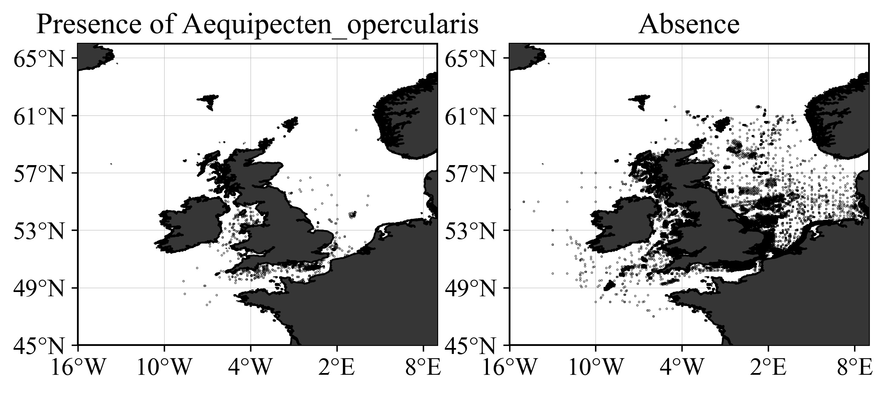
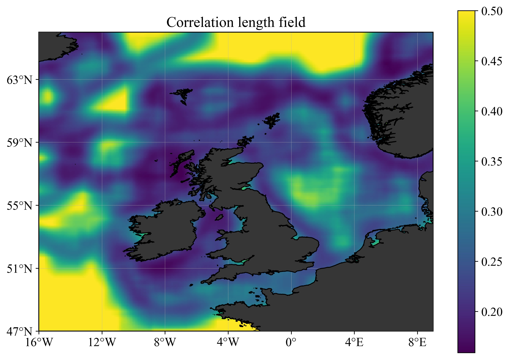
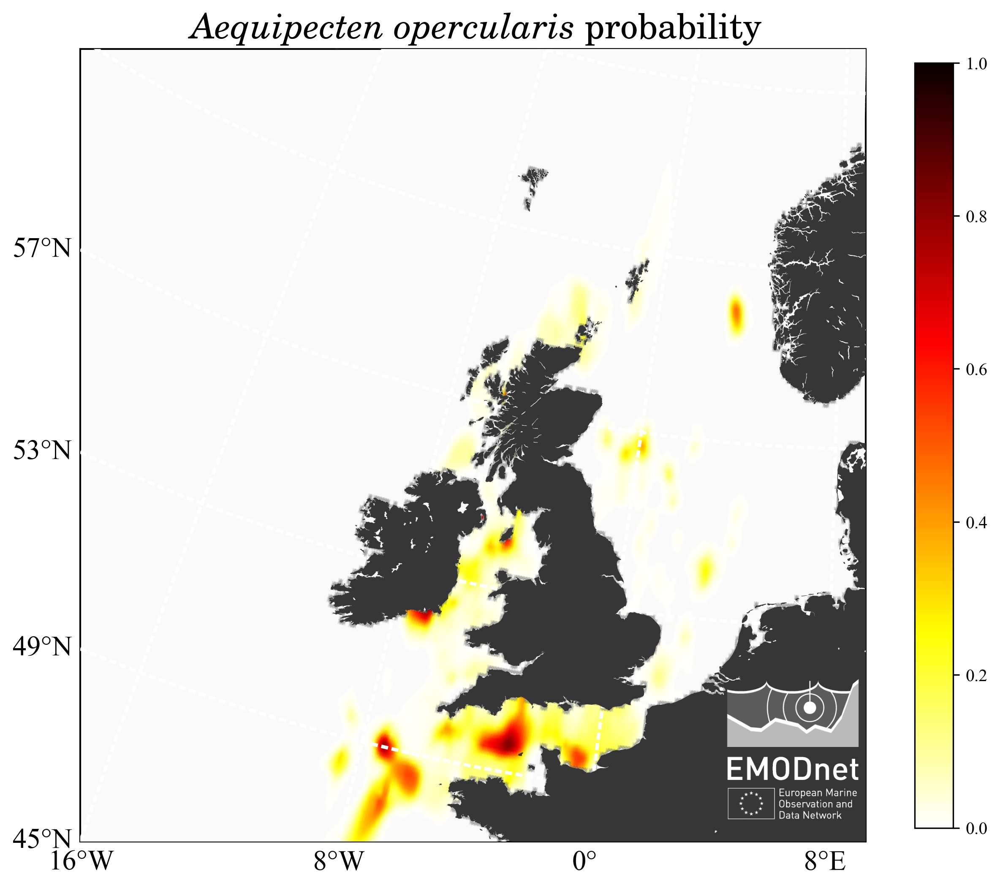
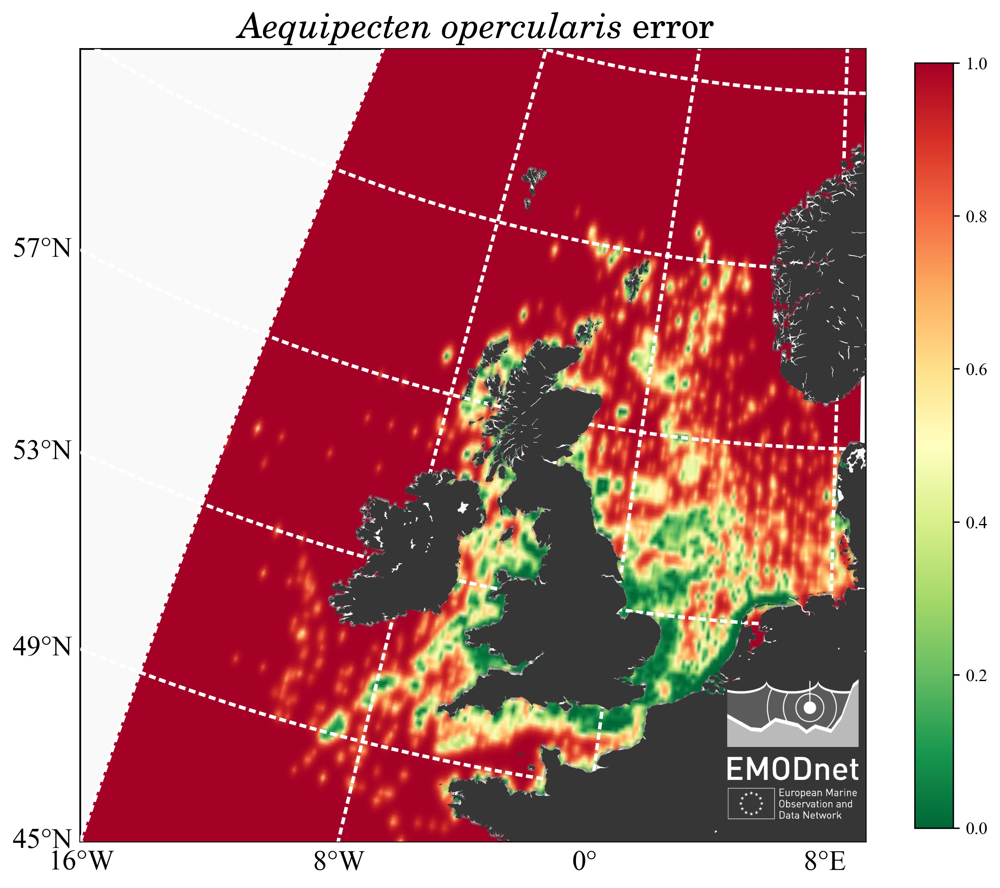

# EMODnet-Biology-Benthos-Interpolated-Maps

`DIVA` (Data Interpolating Variational Analysis) and `DIVAnd` (DIVA in __n__ dimensions) are software tools designed to generate gridded maps of continuous variables such as sea water temperature, salinity or oxygen concentration. The main advantages over other interpolation or analysis method are:
* coastlines and physical boundaries are taken into account by the method.
* large datasets (million of data points) can be ingested and processed by the tool.

`DIVAnd` is a multi-dimensional generalization ([Barth et al., 2014](https://dx.doi.org/10.5194/gmd-7-225-2014)), written in the [Julia language](https://julialang.org/), with a new mathematical formulation with respect to the previous [`DIVA`](https://github.com/gher-ulg/DIVA) code.

This directory provides the codes and tools to
- process the presence/absence data relative to different _benthos_ species, and
- generate the gridded and error fields using `DIVAnd`.

## DIVAnd for presence/absence data

The dataset to be processed contained only a binary information: _presence_ or _absence_, and the objective is to derive a map showing the probability to encounter a given species, as illustrated below for _Aequipecten opercularis_.




## Directory structure

```
EMODnet-Biology-Benthos-Interpolated-Maps/
├── analysis
├── data/
├── docs/
├── product/
│   ├── figures/
│   └── netCDF/
└── scripts/
```

* **analysis** - Jupyter notebooks used to perform the data analysis, create the figures and the `netCDF` files.
* **data** - input data files.
* **docs** - Rendered reports
* **product** - Output product files: `netCDF` containing the gridded, probability fields and the corresponding figures in `PNG` or `JPG` format.
* **scripts** - Reusable code: functions employed in the Jupyter notebooks.

## Data

The main data file is `spe.csv`, it contains all sampling events as rows, and the most frequent species (occurrence >200) as columns. The first columns specify sampling event and location. All columns are coded as __‘pa’__ (for presence/absence) followed by the `AphiaID` of the species. In the separate file `specieslist.csv` you find the names of the species corresponding to their `AphiaID`. You also find the total number of events where the species has been found.

A species can have value __1__ (present), __0__ (looked for but absent) and __NA__ (not looked for). The NA values must be disregarded when making maps. They do not contain information about either presence or absence. There are NAs in the file because some datasets only look for a subset of species.

The information about the occurrence of a species is obtained with the function
`read_coords_species` defined in the script  [`BenthosInterp.jl`](scripts/BenthosInterp.jl). The species are selected by using the _AphiaID_.

## Analysis

This directory contains the notebooks for the preparation and analysis of the data, as well as the generation of the figures.

### Method

For a given species, two _heatmaps_ are computed: one of the presence, the other
for the absences. Then the probability (between 0 and 1) is computed using the
following formula:  
```
d = npre * dens_pre / (npre * dens_pre + nabs * dens_abs)
```
where
* `npre` is the total number of absence data points;
* `nabs` is the total number of absence data point;
* `dens_pre` is the heatmap obtained with the presence data only;
* `dens_abs` is the heatmap obtained with the absence data only.

If we have only presence data, the 2nd term of the denominator is zero and
the probability reduces to the presence heatmap.
The absence data decrease the ratio and hence the probability.

### Products

Two types of analysis are performed:
1. Using a uniform correlation length all over the domain (0.1°) (directory `1-UniformL`)
2. Using a spatially variable correlation length (see figure below), derives from the substrates (directory `2-VariableL`).

For both anaysis, 2 types of products are created (described in the next section):
1. Figures (jpg format).
2. NetCDF files.



### Jupyter notebooks

* [`interp_presence_absence_benthos`](analysis/interp_presence_absence_benthos.ipynb):
1. prepare the domain and the bathymetry,
2. read the coordinates of presence and absence for each species,
3. compute the probability map and the associated error field and
4. write the results in a netCDF file (one per species and one global for all
	the species), in the directory `product/netCDF`

* [`plot_results_map.ipynb`](analysis/plot_results_map.ipynb): notebook in `Python` to create the figures using the _ETRS89 Lambert Azimuthal Equal Area_ coordinate reference system of 2001 (`EPGS 3035`).     
The figures are stored in `product/figures` and consist of
1. The interpolated probability map
2. The relative error field
3. The interpolated probability masked by the error field: for some species the
computed probability displays high and non-realistic values, due to the ratio of very small (but different) values in regions without observations.




### Code

The code, written in `Julia`, is distributed through GitHub:
https://github.com/EMODnet/EMODnet-Biology-Benthos-Interpolated-Maps

## Citation

Please cite this product as:
*A. Barth, P. Hermann and C. Troupin (2020). Probability maps
for different benthos species in the North Sea. Integrated data products created under the European Marine Observation Data Network (EMODnet) Biology project (EASME/EMFF/2017/1.3.1.2/02/SI2.789013), funded by the European Union under Regulation (EU) No 508/2014 of the European Parliament and of the Council of 15 May 2014 on the European Maritime and Fisheries Fund.*

The code is free software; you can redistribute it and/or modify it under the terms of the GNU General Public License as published by the Free Software Foundation; either version 2 of the License, or (at your option) any later version.
